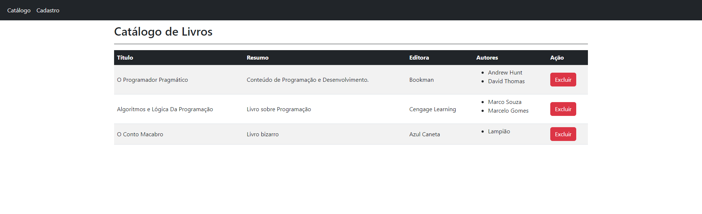

# Instruções para iniciar a aplicação

Um catálogo de livro usando Angular e Bootstrap, você pode ver ele funcionando em:

- <a href="[http://example.com/](https://livros-angular.vercel.app)" target="_blank">[example](https://livros-angular.vercel.app)</a>

# Passos 

## `npm install`

Após executar o comando abaixo a aplicação poderá ser visualizada no endereço http://localhost:4200/

## `ng serve`

